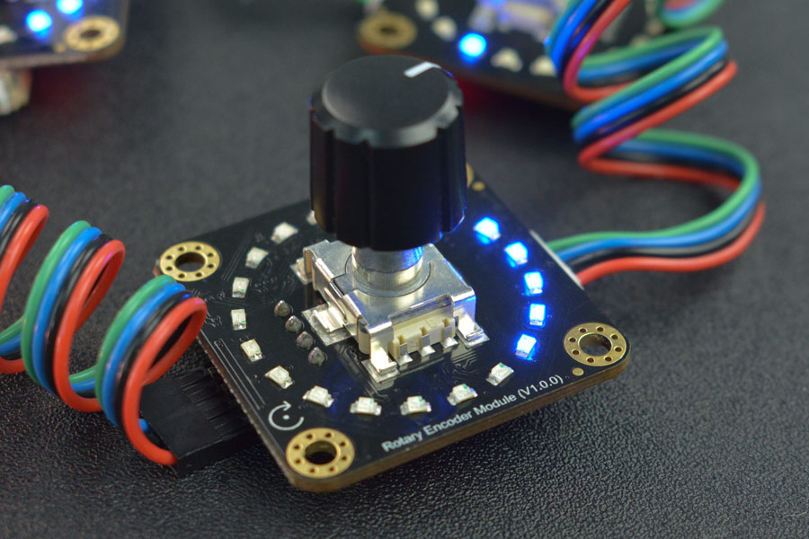

# DFRobot_VisualRotaryEncoder
* [English Version](./README.md)

这是一款使用简单的旋转编码器。使用了Gravity-I2C接口输出数据。与常规的电位器相比，它有更好的手感，更高的精度，旋转步进精度可设置。并且，有一圈LED显示当前的值，形象直观。

可用做音量调节，火力调节，转速调节 ；级联3个旋转编码器，可调节RGB灯的输出状态。




## 产品链接 (https://www.dfrobot.com.cn/goods-3516.html)
    SKU：SEN0502


## 目录

* [概述](#概述)
* [库安装](#库安装)
* [方法](#方法)
* [兼容性](#兼容性)
* [历史](#历史)
* [创作者](#创作者)


## 概述

* I2C数据输出，正转加1，反转减1，使用简单明了。<br>
* 环形LED灯显示当前的值，漂亮直观。<br>
* 2个I2C端口输出，可级联使用。<br>


## 库安装

使用库，首先下载库文件，将其粘贴到指定的目录中，然后打开Examples文件夹并在该文件夹中运行演示。


## 方法

```python

    '''!
      @brief Initialize sensor
      @return  返回初始化状态
      @retval True indicate initialization succeed
      @retval False indicate failed
    '''
    def begin(self):

    '''!
      @brief 读取模块基本信息
      @n     重新从传感器获取其基本信息, 并缓存到存储信息的变量里面:
      @n     PID, VID, version, I2C_addr
    '''
    def read_basic_info(self):

    '''!
      @brief 获取编码器当前计数值
      @return 返回值范围为： 0-1023
    '''
    def get_encoder_value(self):

    '''!
      @brief 设置编码器计数值
      @param value 范围[0, 1023], 超出范围设置无效
    '''
    def set_encoder_value(self, value):

    '''!
      @brief 获取编码器当前增益系数，转动一格的数值精度。
      @n     精度范围：1~51，最小为1（转动约2.5圈LED灯亮一个），最大为51（转动一格LED灯就亮起一个）。
      @return 返回值范围为： 1-51
    '''
    def get_gain_coefficient(self):

    '''!
      @brief 设置编码器增益系数，转动一格的数值精度。
      @n     精度范围：1~51，最小为1（转动约2.5圈LED灯亮一个），最大为51（转动一格LED灯就亮起一个）。
      @param gainValue 范围[1, 51], 超出范围设置无效
    '''
    def set_gain_coefficient(self, gain_value):

    '''!
      @brief 检测按键是否已按下
      @return 返回true 已检测到按键按下，返回false 未检测到按键按下
    '''
    def detect_button_down(self):

```


## 兼容性

* RaspberryPi 版本

| Board        | Work Well | Work Wrong | Untested | Remarks |
| ------------ | :-------: | :--------: | :------: | ------- |
| RaspberryPi2 |           |            |    √     |         |
| RaspberryPi3 |           |            |    √     |         |
| RaspberryPi4 |     √     |            |          |         |

* Python 版本

| Python  | Work Well | Work Wrong | Untested | Remarks |
| ------- | :-------: | :--------: | :------: | ------- |
| Python2 |     √     |            |          |         |
| Python3 |     √     |            |          |         |


## 历史

- 2021/09/15 - 1.0.0 版本
- 2022/05/20 - 1.0.1 版本


## 创作者

Written by qsjhyy(yihuan.huang@dfrobot.com), 2022. (Welcome to our [website](https://www.dfrobot.com/))
